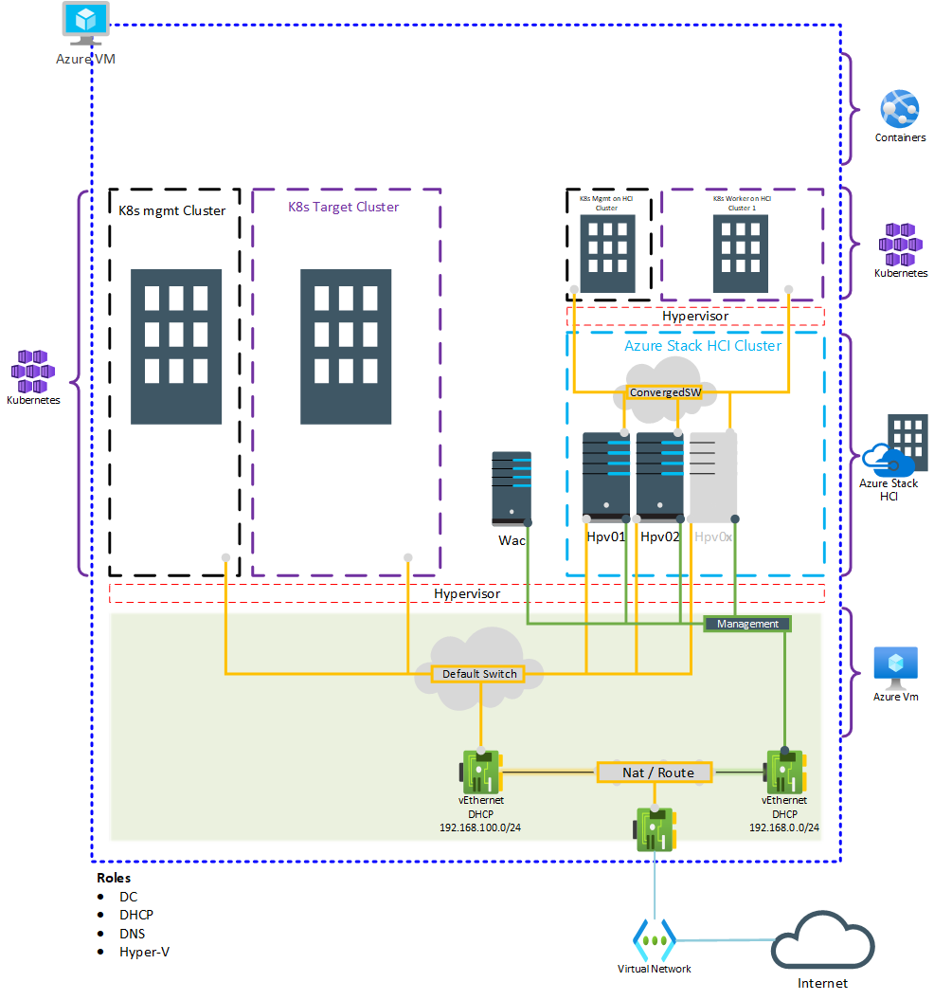

# Proof of Concept Aks Hci on Azure Stack HCI

This repository is designed to simplify Aks Hci demos in mind for people who are developers without domain knowledge or IT-Pros without Virtualization knowledge. Once Arm template deployed, Azure Stack HCI and Windows Admin Center VMs will be created automatically. Windows Admin center or following PowerShell scripts can be utilized for completing Azure Stack HCI deployment in couple of minutes.

## Lab design

Azure Stack HCI host counts and memory sizes (and many other options) can be configured from Arm template parameters during deployment. By default, Arm template deploys Azure VM with 2 Azure Stack HCI hosts (4 Processors and 22 GB Ram) and 1 Windows Admin Center VM which is suitable for most cases. Azure VM will serve as  **Domain controller** and **Hypervisor** for the environment.

**Note:** Arm template deployment takes about 25 minutes. During the deployment, VM can be accessible but DSC configuration will be running in the background to complete some of the following tasks.

* Enable roles and features (AD and Hyper-v Mainly)
* Configure Domain Controller role
* Download Azure Stack HCI Iso file
* Created Azure Stack HCI vhdx file from Iso file
* Download DSC configuration scripts to configure Azure Stack HCI hosts and Windows Admin Center host
* Creates Azure Stack HCI and Windows Admin Center VMs using Differential disks.



## Pre-requisites

Following simple steps are required before starting any Demo on Aks Hci environment.

**Do not use 192.168.0.0/24 , 192.168.100.0/24 , 192.168.251.0/24, 192.168.252.0/24, 192.168.253.0/24 , 192.168.254.0/24 networks as address space for Vnet since those network are getting utilized in the Nested environment.**

### High level overview of process

* Deploy Azure Stack HCI Cluster (Deploy-AzsHciCluster.ps1) Approximate run time 10 mins.
* Prepare Azure Stack HCI Cluster for Aks Hci deployment (Deploy-AzsHciCluster.ps1)
* Add Azure Stack HCI cluster to Windows Admin Center
* Register Windows Admin Center to Azure
* Register Azure Stack HCI Cluster to Azure (Required to run any workload on the cluster)
* Deploy Aks Hci Management Cluster (Deploy-AksHCIManagementCluster.ps1)
* Deploy Aks Hci Worker Clusters (Deploy-AksHCIWorkerCluster.ps1)

### Using scripts in the repository

During the provisioning process of the Azure VM repository is getting downloaded to V:\Source folder. Logon to the Azure VM and open Powershell ISE copy the following code as new script and run. The following code will extract github repository and open up all required PowerShell scripts in PowerShell ISE window.

```powershell

$branch = 'master'
Expand-Archive V:\source\$branch.zip V:\source\branchData -Force
ise V:\source\branchData\AzureStackHCIonAzure-$branch\scripts\Deploy-AzsHciCluster.ps1
ise V:\source\branchData\AzureStackHCIonAzure-$branch\scripts\Deploy-AksHCIManagementCluster.ps1
ise V:\source\branchData\AzureStackHCIonAzure-$branch\scripts\Deploy-AksHCIWorkerCluster.ps1

```

### Deploy Azure Stack HCI using PowerShell and prepare cluster for Aks Hci deployment

As mentioned earlier Azure Stack HCI deployment is simplified into a wizard with the provided modules in the repository for the sake of abstraction to run PoC. Run following PowerShell cmdlet or switch to **Deploy-AzsHciCluster.ps1** script tab in the ISE. Once run following cmdlet will guide you through the steps required to complete for Azure Stack HCI cluster deployment and preparation for Aks Hci deployment.

Following set of topics will be prompted. (During the first run default option can be used, by pressing Enter or selecting zero)

* Cleanup VMs options (optional for first time)
* Install roles and features options
* Azure Stack HCI network configuration options
* Disk clean up options (optional for first time)
* Cluster setup options
* Prepare Azure Stack HCI VMs for Aks Hci pre-requsites

```powershell

Start-AzureStackHciSetup

```

### Deploy Azure Stack HCI using Windows Admin Center

Connect to Windows Admin Center https://wac or open Windows Admin Center shortcut on the desktop of Azure VM.


